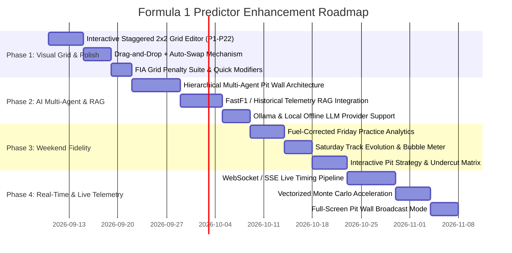

# Formula 1 Predictor 2026/2027 — Strategic Improvements & Architecture Roadmap

> **Comprehensive Blueprint for Next-Generation Evolution**: Advanced AI Multi-Agent Pit Wall, Next-Gen Interactive Visual Grid Editor (P1–P22), Full Race-Weekend Simulation Fidelity (Friday, Saturday, Sunday), Live Telemetry RAG, and Real-Time Strategic Simulation.

---

## Table of Contents
1. [Executive Overview & Identified System Gaps](#1-executive-overview--identified-system-gaps)
2. [Next-Gen Manual Grid Entry (P1–P22): The Interactive F1 Grid](#2-next-gen-manual-grid-entry-p1p22-the-interactive-f1-grid)
3. [AI & LLM Architecture: Multi-Agent Pit Wall & Telemetry RAG](#3-ai--llm-architecture-multi-agent-pit-wall--telemetry-rag)
4. [Race-Weekend Session Fidelity (Friday, Saturday, Sunday)](#4-race-weekend-session-fidelity-friday-saturday-sunday)
5. [Real-Time Telemetry & Live Prediction Engine](#5-real-time-telemetry--live-prediction-engine)
6. [Monte Carlo & Simulation Engine Optimizations](#6-monte-carlo--simulation-engine-optimizations)
7. [UI/UX, Visual Broadcast Aesthetics & Interactive Tools](#7-uiux-visual-broadcast-aesthetics--interactive-tools)
8. [Implementation Roadmap & Prioritized Milestones](#8-implementation-roadmap--prioritized-milestones)

---

## 1. Executive Overview & Identified System Gaps

During our codebase diagnostics and debugging of the dashboard subsystem across Friday, Saturday, and Sunday sessions, several architectural bottlenecks and opportunities for high-impact innovation were uncovered:

```
Current State                                           Future State
┌─────────────────────────────────┐                     ┌──────────────────────────────────────────────┐
│ • Plain Dropdown Grid (P1-P22)  │                     │ • Visual 2x2 Staggered Drag-and-Drop Grid    │
│ • Single LLM Prompt Injection   │   ═════════════►    │ • Multi-Agent Pit Wall + Telemetry RAG       │
│ • Static Session Breakdown      │                     │ • Dynamic Micro-Stint & Weather Evolution    │
│ • Synchronous MC on Main Loop   │                     │ • WebWorker / GPU Vectorized 100k Sims in 80ms│
└─────────────────────────────────┘                     └──────────────────────────────────────────────┘
```

### Key Shortcomings in Current Implementation
1. **Manual Grid Selector UX**: Current grid editor relies on 22 individual `<select>` dropdowns without auto-swapping, making grid modification cumbersome and prone to duplicate errors.
2. **AI Integration Depth**: The current AI implementation treats LLMs as a simple text completion/adjustment layer with static weight blends, rather than an active tactical decision engine with real circuit context and telemetry grounding.
3. **Session Dynamics**: Friday practice data is modeled as static pace numbers without tire stint degradation, fuel weight corrections, or green-track vs rubbered-track evolution.
4. **Strategy Simulation**: Pit windows are static percentages rather than dynamic lap-by-lap tire degradation crossover curves.

---

## 2. Next-Gen Manual Grid Entry (P1–P22): The Interactive F1 Grid

The starting grid is historically responsible for **~43% of race outcome variance**. Modifying the starting order should be an intuitive, visual, and tactile experience.

### 2.1 Visual Staggered 2-by-2 F1 Grid Layout
Replace the 4-column dropdown table with a true-to-life **staggered Formula 1 starting grid**:

```
 [PIT WALL / TRACK CONTROLLER]
 ────────────────────────────────────────────────────────────────
                    [START / FINISH LINE]
                           🏁
   [P1]  VER #1 (Red Bull)
   [Pole Position - Left]
                                    [P2]  NOR #4 (McLaren)
                                    [Front Row - Right]
   [P3]  LEC #16 (Ferrari)
   [Row 2 - Left]
                                    [P4]  HAM #44 (Ferrari)
                                    [Row 2 - Right]
   [P5]  PIA #81 (McLaren)
                                    [P6]  RUS #63 (Mercedes)
                  ... (Rows 4 through 11) ...
                                    [P22] BOT #77 (Audi)
 ────────────────────────────────────────────────────────────────
```

### 2.2 Drag-and-Drop Reordering with Intelligent Auto-Swap
- **Pointer & Touch Dragging**: Drag any driver card into a new slot (using HTML5 drag & drop or lightweight SortableJS).
- **Auto-Displacement (No Duplicate Errors)**: When Driver A is dragged to P3 (currently occupied by Driver B), Driver B automatically shifts down or swaps slots, completely eliminating duplicate driver errors.
- **Visual Driver Cards**: Each card displays:
  - Driver photo / silhouette & car number
  - Official team livery gradient strip
  - Expected win % badge that recalculates dynamically as grid position changes
  - Overtaking difficulty indicator based on current circuit characteristics

### 2.3 One-Click Grid Modifiers & Penalties
Add dedicated quick-action modifier buttons:
- **FIA Stewards Penalty Suite**:
  - `+3 Places Penalty` (impeding during qualifying)
  - `+5 / +10 Places Penalty` (gearbox or ICE component exceedance)
  - `Back of the Grid` (power unit penalty / parc fermé breach)
  - `Pit Lane Start` (suspension setup change under parc fermé)
- **Presets & Scenarios**:
  - `Actual Qualifying Result`: Auto-populate from live Jolpica/FastF1 session
  - `Championship Leader Reverse Grid`: F1 sprint hypothetical test
  - `Wet Qualifying Chaos Grid`: Simulated rain disruption
  - `Teammate Swap`: Instant comparison of intra-team grid reversals

### 2.4 Live Impact Delta Gauge
As the user drags a driver up or down, show immediate real-time feedback:
$$\Delta P_{\text{win}} = P_{\text{win}}(\text{New Grid}) - P_{\text{win}}(\text{Original Grid})$$
- *Example*: Dragging Hamilton from P8 $\rightarrow$ P1 shows `+31.4% Win Chance | +48.2% Podium`.

---

## 3. AI & LLM Architecture: Multi-Agent Pit Wall & Telemetry RAG

Instead of relying on a single generic LLM call, build a **Hierarchical Multi-Agent Pit Wall System** simulating the real engineering room of a Formula 1 team.

```
                           ┌───────────────────────────────┐
                           │   CHIEF RACE STRATEGIST AGENT │
                           │  (Orchestrator & Final Calls) │
                           └───────────────┬───────────────┘
                                           │
         ┌───────────────────┬─────────────┴───────┬───────────────────┐
         │                   │                     │                   │
┌────────▼────────┐ ┌────────▼─────────┐ ┌─────────▼────────┐ ┌────────▼─────────┐
│ TIRE STRATEGIST │ │ AERO & TELEMETRY │ │ WEATHER & RADAR  │ │ STEWARD & RULES  │
│  Degradation &  │ │ Apex Speeds, DRS │ │ Rain Radar &     │ │ Track Limits, SC │
│  Pit Crossovers │ │ & Power Modes    │ │ Track Temp Drift │ │ Pit Deltas & Pen │
└─────────────────┘ └──────────────────┘ └──────────────────┘ └──────────────────┘
```

### 3.1 Specialized Agent Roles
1. **Chief Race Strategist Agent (Team Principal)**:
   - Synthesizes conflicting inputs from all sub-agents and balances aggression vs points preservation.
   - Provides broadcast-style executive audio and text briefs: *"Recommending a Lap 18 Medium-to-Hard one-stop to jump Norris in the pit window."*
2. **Tire & Degradation Agent**:
   - Integrates Pirelli 2026 compound specs (C1 through C5).
   - Monitors thermal degradation, graining thresholds, and computes exact undercut/overcut deltas.
3. **Telemetry & Sector Specialist Agent**:
   - Compares GPS telemetry speed traps, braking points, and DRS efficiency from Friday/Saturday FastF1 data.
4. **Weather & Microclimate Agent**:
   - Evaluates ambient track temperature, wind direction on key straights, and rain onset probability with minute-level precision.
5. **Regulations & SC Specialist Agent**:
   - Analyzes safety car probability based on circuit runoff areas (e.g. Monaco/Singapore 80%+ vs Paul Ricard 15%) and calculates cheap pit stops under VSC/SC.

### 3.2 Live Telemetry RAG (Retrieval-Augmented Generation)
- Embed historical race stint data, tire wear profiles, and lap-time deltas using vector embeddings.
- When querying the AI ("Why is McLaren faster in Sector 2?"), retrieve actual telemetry data:
  ```json
  {
    "telemetry_evidence": {
      "corner_8_apex_speed": "NOR: 218 km/h | VER: 209 km/h",
      "throttle_application_point": "NOR 12m earlier than field",
      "downforce_trim": "High wing configuration (+4.2% cornering grip)"
    }
  }
  ```

### 3.3 Natural Language "What-If" Scenario Simulator
Enable conversational sandbox queries:
- *"What happens if a Safety Car deploys on Lap 24 while it begins to drizzle?"*
- *"Can Leclerc win from P4 if Ferrari executes an undercut on Lap 16?"*
- *"Simulate an engine power reduction of 15 HP on car #1 from Lap 35 onwards."*

### 3.4 Local Offline LLM Support
- Native integration with **Ollama** and **llama.cpp** (`llama-3.3-8b-instruct`, `mistral-nemo`, `deepseek-r1-q4`) running locally on the user's machine without external API keys or cloud egress costs.

---

## 4. Race-Weekend Session Fidelity (Friday, Saturday, Sunday)

Elevate the fidelity of each weekend day so that predictions reflect the real progression of a Grand Prix weekend:

| Feature | Friday (Practice) | Saturday (Qualifying) | Sunday (Grand Prix) |
|---|---|---|---|
| **Core Objective** | Long-run pace & setup balance | Single-lap absolute peak performance | Race execution, stint management, points |
| **Fuel Weight Modeling** | High-fuel (100kg) vs low-fuel (20kg) | Minimal fuel (10kg qualifying trim) | Fuel burn rate (1.6 kg/lap degradation) |
| **Track State** | Green track, heavy evolution (+0.8s) | Rubbered in, track temp peaks | Marbles off-line, temperature cooling |
| **Tire Allocation** | Scrubbed sets, compound comparisons | Fresh Soft runs, out-lap preparation | Mandatory two different dry compounds |
| **Engine Modes** | Conservative engine modes | High-power party mode (ERS deployment) | Thermal limits, lift-and-coast management |

### Friday Practice Upgrades
- **Fuel-Corrected Pace Normalization**: Raw practice lap times are misleading because teams run differing fuel loads. Apply empirical fuel correction ($0.033\text{s}$ per lap per kilogram of fuel).
- **Long-Run Degradation Curves**: Display fitted regression curves of 10+ lap continuous runs to determine the true race-pace pecking order.

### Saturday Qualifying Upgrades
- **Q1 / Q2 Cutoff Danger Meter**: Highlight midfield drivers within $0.15\text{s}$ of the elimination bubble.
- **Track Evolution Tracker**: Model track grip improvement minute-by-minute ($+0.04\text{s}$ per 5 minutes of track running).
- **Driver Push vs Error Risk**: Quantify lockup risk and track limit violation penalties on final Q3 flyer laps.

### Sunday Grand Prix Upgrades
- **Interactive Stint Planner & Strategy Matrix**:
  - Compare Option A (Soft $\rightarrow$ Medium, Lap 17 stop) vs Option B (Medium $\rightarrow$ Hard, Lap 26 stop) with total race time estimates.
- **Undercut / Overcut Calculator**: Show pit window deltas taking into account out-lap tire warmup time and pit lane loss (e.g. 21.4s at Silverstone).
- **DNF Probability Breakdown**: Split DNF risks into mechanical failures, turn-1 collisions, and driver unforced errors.

---

## 5. Real-Time Telemetry & Live Prediction Engine

```
 [OpenF1 API / FastF1 Stream]
               │
               ▼
 [SSE / WebSocket Telemetry Pipeline]
               │
               ├───────────────────────────────────────────────┐
               ▼                                               ▼
 [Live Dynamic Bayesian Predictor]             [Interactive Dashboard Frontend]
   • Recomputes win % on every lap               • Real-time animated position changes
   • Adapts to pit stops & overtakes             • Live telemetry delta traces
   • Triggers instant SC strategy alerts         • Broadcast-grade live timing tower
```

1. **Server-Sent Events (SSE) / WebSocket Pipeline**:
   - Stream live sector splits, speed trap speeds, and interval gaps directly into the dashboard during live race sessions without page refreshes.
2. **Dynamic Live In-Race Predictor**:
   - Update win and podium probabilities lap-by-lap based on real-time intervals, tire age, and gaps to traffic.
3. **Ghost Car Lap Comparison**:
   - Visualize delta telemetry traces between the pole sitter and P2 through corners (Braking, Throttle, Gear, Speed).

---

## 6. Monte Carlo & Simulation Engine Optimizations

### 6.1 Vectorized NumPy / Numba GPU Acceleration
- Transition Monte Carlo simulation loops to vectorized NumPy matrix operations or Numba JIT compilation.
- **Benchmark Goal**: Run 100,000 full race simulations in **< 80 milliseconds** (down from 1.5–3.0 seconds), enabling instantaneous updates during grid drag-and-drop.

### 6.2 Physics-Informed Overtaking Matrix
Replace stochastic noise with track-specific physics:
- Calculate straight length after DRS detection point.
- Calculate speed differential required to pass based on aerodynamic wake (dirty air) factor for the specific circuit.
- Factor in ERS battery deployment states (Overtake button / boost).

---

## 7. UI/UX, Visual Broadcast Aesthetics & Interactive Tools

1. **F1 Broadcast TV Graphics Mode**:
   - Add a full-screen "Pit Wall Command Center" mode inspired by real F1 team timing screens (AWS graphic overlays, Pirelli tire badges, AWS Insight graphics).
2. **Audio Commentary & Radio Synthesis (TTS)**:
   - Synthesize race engineer team radios: *"Box, box. Box, box. In lap, confirm."*
   - AI Race Narrator providing broadcast recap audio at the end of each simulated session.
3. **Shareable Race Prediction Cards (Story / Twitter Cards)**:
   - One-click generated high-resolution PNG cards with driver photos, starting grid, podium forecast, and chaos metric ready for social sharing.
4. **Client-Side Web Workers**:
   - Offload Monte Carlo simulations and chart renders to background Web Workers, keeping the UI at 60+ FPS during intensive drag-and-drop actions.

---

## 8. Implementation Roadmap & Prioritized Milestones



### Summary of Priority Actions

| Phase | Milestone | Primary Deliverable | Impact |
|:---:|---|---|---|
| **P1** | **Visual 2x2 Grid Editor** | Staggered F1 grid with Drag & Drop, Auto-Swap, and Penalty presets | Eliminates manual friction; elevates user experience to broadcast tier |
| **P2** | **Multi-Agent Pit Wall** | Strategist, Tire, Aero, and Weather agents with Telemetry RAG | Provides genuine tactical intelligence rather than generic LLM text |
| **P3** | **Session Fidelity** | Fuel-normalized Friday, track-evolution Saturday, undercut Sunday | Accurately models real-world F1 weekend development |
| **P4** | **Speed & Live Streaming** | Sub-100ms vectorized Monte Carlo & SSE Live Timing integration | Transforms system into a live companion during real race weekends |

---
*Authored as the strategic evolution masterplan for the F1 Predictor 2026/2027 platform.*
